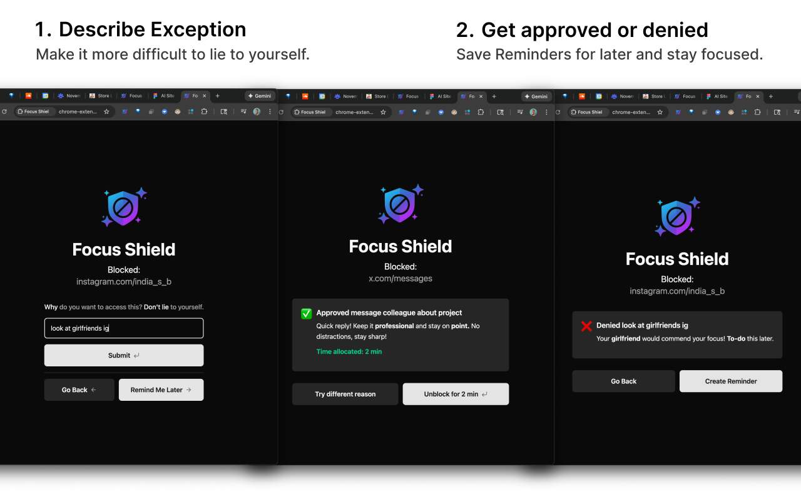
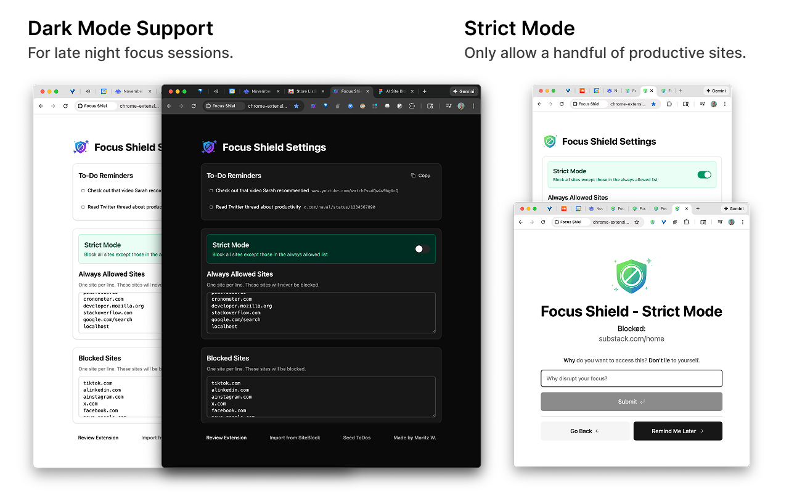

<div align="center">


# Focus Shield

**The first site blocker with an AI bouncer.**

Instead of blocking distracting sites outright, Focus Shield asks *why* you want to visit. Based on your reasoning it either blocks you or grants a specific duration, then re-blocks automatically. No manual timers. No workarounds. No willpower battles.

[**Install from the Chrome Web Store**](https://chromewebstore.google.com/detail/focus-shield-ai-site-dist/ibmmihgadnkilmknmfmohlclogcifboj)

</div>



## The secret: typing your reason makes you self-aware

It is easy to lie to yourself clicking "just 5 more minutes." But when you have to *type* "check how many likes my post got" you suddenly realize: is this really what I need right now? The bouncer forces honest self-reflection before every distraction.

| You type | You get |
| --- | --- |
| "Watch React tutorial" | ✅ 15 minutes |
| "Check weather" | ✅ 20 seconds |
| "Check colleague's LinkedIn profile" | ⏰ Saved to To-Do Reminders instead |
| "Scroll X feed" | ❌ Stay focused |

## Features

- **AI bouncer.** Type why you need the site. The model evaluates the reason in context, and can ask a follow-up question before deciding.
- **Smart time-boxing.** The AI picks the duration. Quick lookup gets 30 seconds, a tutorial gets 15 minutes. You never set a timer.
- **Auto-reblock.** When time expires every matching tab redirects back to the block page. A live countdown sits in the toolbar badge.
- **To-Do Reminders.** Found something interesting but not urgent? Save it in one click, GTD style, and check it on your break instead of during deep work. The AI suggests this on its own when something can wait.
- **Strict Mode.** Block everything except your allowed work sites.
- **Access history.** Recent attempts per site feed back into the prompt, so repeated vague reasons get more skepticism, not less.
- **Distraction Mode.** A 10 minute window where your saved reminder sites open freely.
- **SiteBlock import**, dark mode, and no analytics. Your sites, history, and reminders live in `chrome.storage` on your machine.



## How it works

```
client/    Chrome extension (React 19 + TS + Tailwind v4, Manifest V3)
  background/   service worker: tab interception, storage, alarms
  blocked/      the block page and its conversation UI
  options/      settings, history, reminders
server/    Deno API (the bouncer). Deployed on Deno Deploy.
dist/      build output, load this in Chrome
```

The service worker watches tab navigation, matches the hostname against your lists, and redirects to a local block page. That page sends your reason plus page metadata and recent access history to the Deno server, which prompts a model on Groq and returns `{ valid, seconds, message, followUpQuestion }`. On approval the worker writes a temporary unblock and schedules a `chrome.alarms` re-block.

No API key ships in the extension. The request carries the blocked URL, the page title and description, your typed reason, and the recent attempts for that site, so the bouncer has enough context to spot a pattern.

## Quick start

```bash
# 1. Build the extension
cd client && npm install && npm run build   # output goes to ../dist

# 2. Run the bouncer
cd ../server
echo 'GROQ_API_KEY="your-key"' > .env       # get one at console.groq.com
deno task dev                                # http://localhost:8000

# 3. Load in Chrome
# chrome://extensions -> Developer mode -> Load unpacked -> select dist/
```

A dev build (`npm run dev`) points at `http://localhost:8000`; a production build points at the deployed server.

### Server configuration

| Env var | Default | Purpose |
| --- | --- | --- |
| `GROQ_API_KEY` | required | Groq API credentials |
| `GROQ_MODEL` | `openai/gpt-oss-120b` | Swap models without a code change. Groq retires models periodically, which shows up as every request failing at once. |

### Release

1. Bump `version` in `client/manifest.json`
2. `cd client && npm run package` writes `focus-shield-v<version>.zip` to the repo root
3. Upload it to the [Chrome Web Store dashboard](https://chrome.google.com/webstore/devconsole)

## Tech stack

**Extension:** TypeScript, React 19, Tailwind CSS v4, Vite, Manifest V3 service worker.
**Server:** Deno, Groq (`openai/gpt-oss-120b`), Zod for structured output, CORS-enabled REST.
